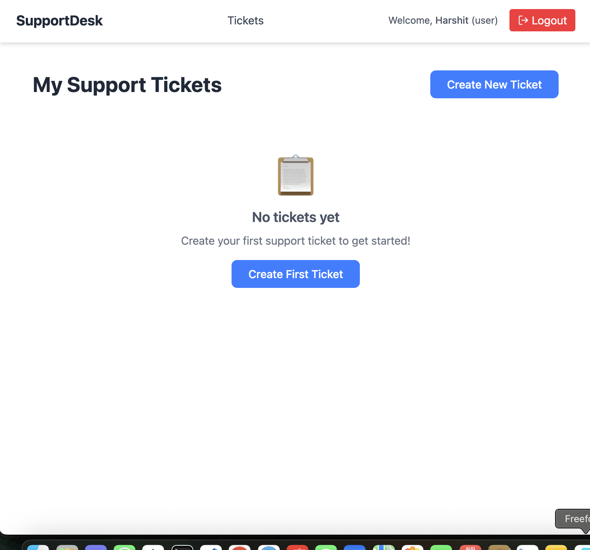
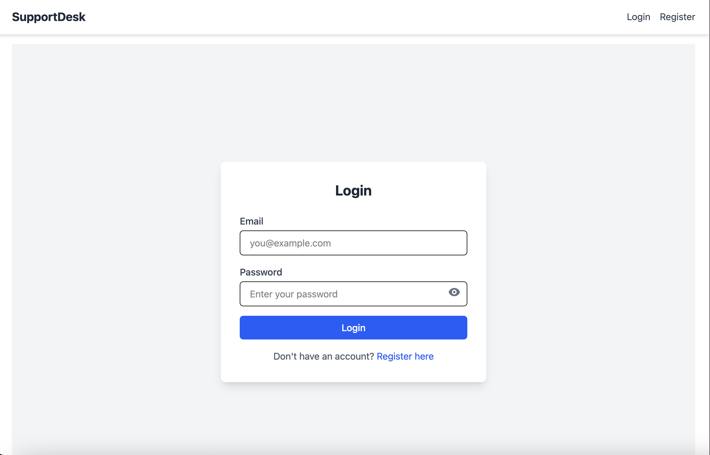
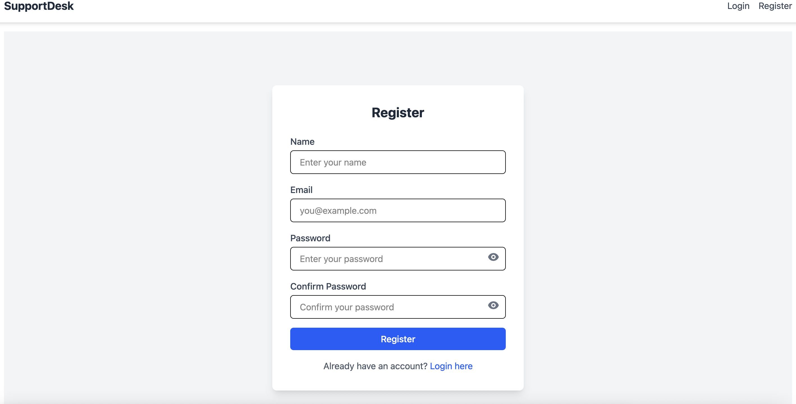
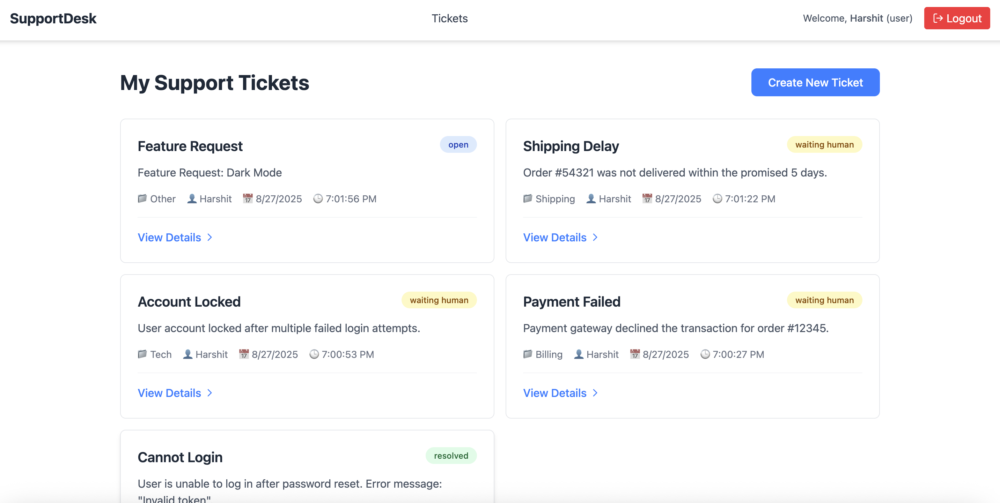
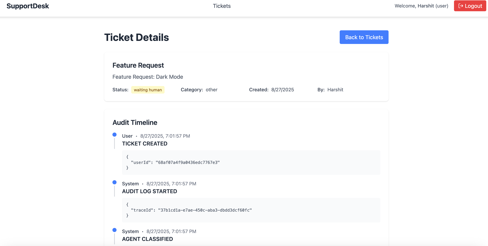

# Wexa Smart Helpdesk

[GitHub Repository](https://github.com/sharmaHarshit2000/wexa-smart-helpdesk) | [Frontend (Vercel)](https://wexa-smart-helpdesk-omega.vercel.app/) | [Backend (Render)](https://wexa-smart-helpdesk-ruu6.onrender.com)

A full-stack helpdesk application with React frontend, Node.js/Express backend, MongoDB database, and Dockerized deployment. Supports user authentication, ticket management, knowledge base articles, and triage services.

---

## Table of Contents

- [Project Overview](#project-overview)  
- [Features](#features)  
- [Tech Stack](#tech-stack)  
- [Project Setup](#project-setup)  
- [Environment Variables](#environment-variables)  
- [Seeding Data](#seeding-data)  
- [Running Locally](#running-locally)  
- [Testing](#testing)  
- [Docker Deployment](#docker-deployment)  
- [API Endpoints](#api-endpoints)  
- [Frontend SPA Routing](#frontend-spa-routing)  
- [Screenshots](#screenshots)  
- [License](#license)  

---

## Project Overview

Wexa Smart Helpdesk is designed to help organizations manage customer support tickets efficiently. It provides:

- User roles: Admin, Support Agent, Regular User  
- Knowledge base management  
- Ticket creation and triage  
- JWT-based authentication  

---

## Features

- User registration and login  
- Role-based access control  
- Create, view, and manage tickets  
- Knowledge base articles  
- Automatic ticket triage (stub mode available)  
- Dockerized backend and frontend for easy deployment  

---

## Tech Stack

- **Frontend:** React, Vite, TailwindCSS  
- **Backend:** Node.js, Express.js, MongoDB, Mongoose  
- **Authentication:** JWT  
- **Testing:** Jest, Supertest  
- **Deployment:** Docker, Nginx, Render, Vercel  

---

## Project Setup

Clone the repository:

```bash
git clone https://github.com/sharmaHarshit2000/wexa-smart-helpdesk.git
cd wexa-smart-helpdesk
```

### Backend Setup
```bash
cd backend
npm install
```

### Frontend Setup
```bash
cd ../frontend
npm install
```

---

## Environment Variables

Create a `.env` file at the root of your project:

```dotenv
# Backend
PORT=3001
MONGO_URI=<your-mongodb-uri>
MONGO_URI_TEST=<your-test-mongodb-uri>
JWT_SECRET=<your-secret-key>
JWT_EXPIRES_IN=7d
AUTO_CLOSE_ENABLED=true
CONFIDENCE_THRESHOLD=0.78
STUB_MODE=true

# Frontend
VITE_API_BASE_URL=http://localhost:3001/api
```

---

## Seeding Data

Seed initial users, articles, and config:

```bash
cd backend
node seed.js
```

Default users:

- Admin: `admin@example.com` / `password123`  
- Agent: `agent@example.com` / `password123`  
- User: `user@example.com` / `password123`  

---

## Running Locally

### Backend
```bash
cd backend
npm run dev
```

### Frontend
```bash
cd frontend
npm run dev
```

Visit: [http://localhost:5173](http://localhost:5173)

---

## Testing

Run backend tests:

```bash
cd backend
npm test
```

---

## Docker Deployment

### Frontend Dockerfile

```dockerfile
# Build stage
FROM node:20-alpine AS build
WORKDIR /app
COPY package*.json ./
RUN npm install
COPY . .
RUN npm run build

# Production stage
FROM nginx:alpine
COPY --from=build /app/dist /usr/share/nginx/html
COPY nginx.conf /etc/nginx/nginx.conf
EXPOSE 80
CMD ["nginx", "-g", "daemon off;"]
```

### Nginx Config (`nginx.conf`)

```nginx
server {
    listen 80;
    server_name localhost;

    root /usr/share/nginx/html;
    index index.html;

    location / {
        try_files $uri /index.html;
    }

    location /api/ {
        proxy_pass http://backend:3001/;
        proxy_http_version 1.1;
        proxy_set_header Upgrade $http_upgrade;
        proxy_set_header Connection 'upgrade';
        proxy_set_header Host $host;
        proxy_cache_bypass $http_upgrade;
    }
}
```

### Running with Docker Compose

```bash
docker-compose up --build
```

---

## API Endpoints

### Auth
| Endpoint | Method | Description |
|----------|--------|-------------|
| /api/auth/register | POST | Register a new user |
| /api/auth/login | POST | Login an existing user |
| /api/auth/me | GET | Get logged-in user info |

### Tickets
| Endpoint | Method | Description |
|----------|--------|-------------|
| /api/tickets | GET | Get all tickets |
| /api/tickets | POST | Create new ticket |
| /api/tickets/:id | GET | Get ticket by ID |
| /api/tickets/:id | PUT | Update ticket by ID |
| /api/tickets/:id | DELETE | Delete ticket by ID |

### Knowledge Base
| Endpoint | Method | Description |
|----------|--------|-------------|
| /api/articles | GET | Get all articles |
| /api/articles | POST | Create article |
| /api/articles/:id | GET | Get article by ID |
| /api/articles/:id | PUT | Update article by ID |
| /api/articles/:id | DELETE | Delete article by ID |

---

## Frontend SPA Routing

To avoid 404 Not Found on page reload for React Router paths:

Ensure `nginx.conf` has:

```nginx
location / {
    try_files $uri /index.html;
}
```

All routes will fallback to `index.html`, preserving SPA routing.

---

## Screenshots

Add screenshots inside `/screenshots` folder for:

### Home Page


### Login / Signup



### Ticket List / Detail



---

## License

MIT License